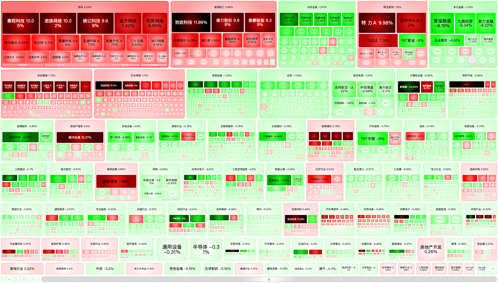

## 市场热力图

A 股股票、基金、ETF 全景热力图可视化工具，基于 FoamTree 交互式矩形树图展示市场板块涨跌分布。

### 功能

- **股票板块** — 行业板块涨跌热力图，直观展示各板块强弱
- **个股** — 个股涨跌分布热力图
- **基金** — ETF 基金净值热力图
- **基金板块** — 基金行业板块分布，支持层级下钻
- **深色模式** — 支持浅色/深色主题切换，状态持久化
- **高清导出** — 支持导出高分辨率 PNG 大图

### 技术栈

Vue 3 · Vue Router 4 · Vite 4 · CarrotSearch FoamTree · Less

### 开发

```bash
npm install
npm run dev
```

### 构建

```bash
npm run build
npm run preview
```

### 代码规范

```bash
npm run lint      # ESLint 检查并自动修复
npm run format    # Prettier 格式化
```

### 数据来源

市场数据来自东方财富（EastMoney）公开 API，通过 JSONP 方式获取实时行情。


